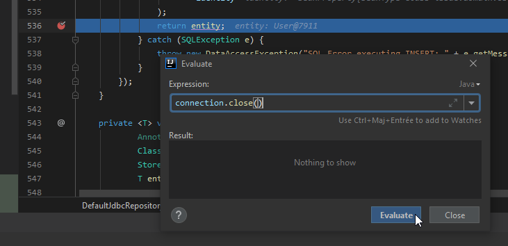
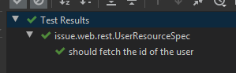

# micronaut-transaction-question

Create application:
```
mn create-app issue --lang groovy --features application,http-client,http-server,jdbc-hikari,liquibase,logback,spock
```

## Question:

Based on the test `issue.web.rest.UserResourceSpec`.

The current error that is returned is that there is no user in the database
```
11:46:06.764 [pool-1-thread-4] ERROR i.m.h.s.netty.RoutingInBoundHandler - Unexpected error occurred: Query produced no result
io.micronaut.data.exceptions.EmptyResultException: Query produced no result
	at io.micronaut.data.runtime.intercept.DefaultFindOneInterceptor.intercept(DefaultFindOneInterceptor.java:59)
	at io.micronaut.data.intercept.DataIntroductionAdvice.intercept(DataIntroductionAdvice.java:79)
```

This behaviour comes from the user that has been created in the `given` part is not commited 
```
def user = createUser(username)
```

To be sure that the issue comes from the commit :

* Go to `io.micronaut.data.jdbc.operations.DefaultJdbcRepositoryOperations` in the method `persistOne`.

* At this end create a breakpoint then run the test is debug.

* Force the connection to commit :



* The test is now successful 

